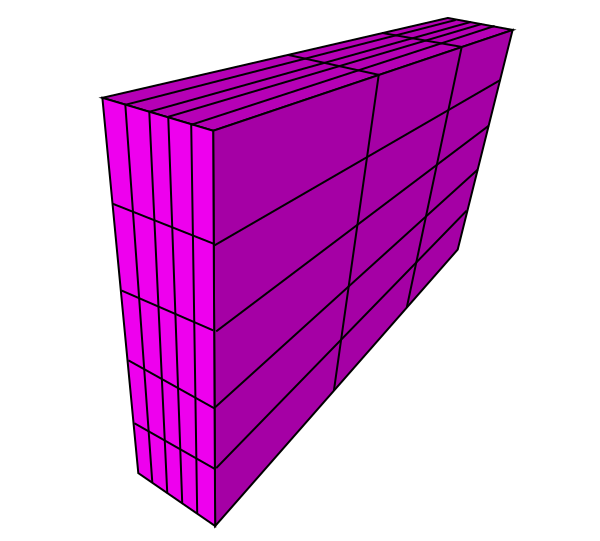

.. SuperKluge documentation master file, created by
   sphinx-quickstart on Fri Jan 16 14:33:12 2015.
   You can adapt this file completely to your liking, but it should at least
   contain the root `toctree` directive.

SuperKluge documentation
************************

.. contents::
   :local:
   :depth: 1

Problems
============

Right now the program has all the functionality, but the edges are so
rough that it is not yet usable for the user. Example problems:

* The viewer only accepts dicom arrays
* The viewer is quite slow with many arrays or a large template. 
* Some GUI functions are extremely unintuitive: ex. the tree widget behavior.
* It assumes no errors: trying to load non-existing file or acting on an unbinded view will crash.

All of these problems will be rectified. In the meantime, you can use
this to convert a dicom into a numpy array::

	import numpy
	import dwi.dwimage
	
	dwimage = dwi.dwimage.load_dicom('path_to_file')
	numpy.save('dicomfile1.npy', data = dwimage.image)

These tasks are quite simple, they shouldn't take long to implement.

Introduction
============

The SuperKluge is a multidimensional array viewer. It can be used to 
visualize multidimensional images, such as those used in medical imaging
. An example image of this type is a DICOM file which consists of voxels
and b-values. These define a 4D array with indices Z, Y, X, B
containing floating point values. The SuperKluge can visualize this by
*taking slices*, i.e. displaying different 2D projections of the array. 

SuperKluge is a work in progress research prototype. The goal
is to use matplotlib and numpy to create a version of the matplotlib's
default viewer for multidimensional images. The displayed data is an
arbitrary numpy array, or a superimposed collection of arrays. This
means that the platform can be extended to perform many kinds of
operations and machine learning tasks external to the viewer.

The viewer should strive for codebase simplicity and extensibility.
It should be possible to add tools and functions without changing the
underlying architecture. Minimal assumptions such as in matplotlib's
viewer imply greater extensibility.

Conceptual model
================

The program consists of a collection of discretized R^D hyperspaces 
with values assigned to each point. We assume that the discretization 
process uses homogenous distances, so that the space is a
multidimensional grid. The grid block may be a hyperractangle, not
necessarily a hypercube, but the block sizes must be consistent.

**TODO: Image of a space with arrays in it**

Each hyperspace can contain one or more arrays, which define the value
at each grid point. If two arrays occupy the same grid, the array order
defines which is superimposed. The hyperspace can also contain abstract
mathematical primitives such as hyperrectangles or hyperellipses, which
are used to choose a set of grid items that belong to the space inside
their boundary.

**TODO: Image of a sliced 3D cube**

A simple example is a 3D cube grid with each pixel colored according to
the value. The program can take slices of this object to three direcions
: X, Y or Z. We must specify which slice to take in the given direction,
and we then get a colored 2D array.

These 2D projections are called *views* in the program. In a D-
dimensional space we must specify D-2 values for which slice to take, 
and then the limits for the view in the achieved 2D space. Each view has
the following attributes:

* Axes *x_i, x_j* view limits *xmin, xmax, ymin, ymax* in the 2D projection.
* D-2 dimensional projection specification *(x_1, ..., x_(D-2))* for which *slice* to take.
* A point *x, y* in the 2D projection, when combined with above translates into D-dimensional point specification.

Internally these are merged into the axes indices *a1,a2*, a bounding
box for the 2D projection *(xmin,xmax,ymin,ymax)* and a D-dimensional
point specification *proj*.

**TODO: Image of the program as a viewer into these spaces**

Programming model
=================

The program has two essential models:

1. A plotting specification
2. A space  specification

Rest of the program is just one large view into these spefications.

The space  specification is the model which contains the space
properties and all the data of arrays placed into the space. Data is
requested from this space for plotting.

The plotting specification determines a set of 2D projections to fetch:
what space they refer to, what projection to take and what view limits
to set. It also contains the template of what window arrangment to use
in the viewer.

All actions in the program change either the space or the plotting
specification. Actions such as loading or removing an image change the
space. Some attributes such as minimum / maximum value to use or the
colormap are also defined as properties in the space or the array in
the space because any change in these should be interpreted as a change
in data.

The toolbar buttons contain actions that manipulate the plotting
specification: sliding through b-values or slices change the underlying
projection specification of the view under action. Similarly, choosing
a point in space does not change the data, but updates all views
referring to that space to refer to that point. Some actions are local
and some are global: a zoom can either zoom all views in a space or only
the view under action.

Here is a high level conceptual overview into the program:

**TODO**

Here is a detailed class hierarchy of the program:

**TODO**

GUI Tools
=========

The program has user oriented tools for view manipulation. The tools are placed in the
toolbar, and most of them have 3 modes. A left click&drag changes the
values continously, a mouse scroll up/down changes them discretely, and
right click brings up a menu. Many tools have the possibility to limit
the action to the view clicked (local), or sync the action to all views
referring to the same space as the view (global).

==================  ==========================  ==========================  ===========
Name                Drag                        Scroll                      Right-click
==================  ==========================  ==========================  ===========
Crosshair           Sync views to a point       Change slice up/down        Change viewer template to display region around a point
BValues             Go through bvalues          Change bvalue up/down       Change mode: global/local
Zoom                Go through zoom levels      Change zoom level up/down   Change mode: global/local
Move                Pan the view                N/A                         N/A
Projection          Cycle projection axes       N/A                         Select X/Y/Z
Space               N/A                         N/A                         Select referred space
Template            N/A                         N/A                         Select viewer template
HyperRectangle      Select ROI in axes          Select ROI in norm          Select ROI under edit, matching base type
HyperEllipse        Select ROI in axes          Select ROI in norm          Select ROI under edit, matching base type
==================  ==========================  ==========================  ===========

**TODO: Icons**

TODO
====

Milk, butter, bread, eggs...

Indices and tables
------------------

* :ref:`genindex`
* :ref:`modindex`
* :ref:`search`

